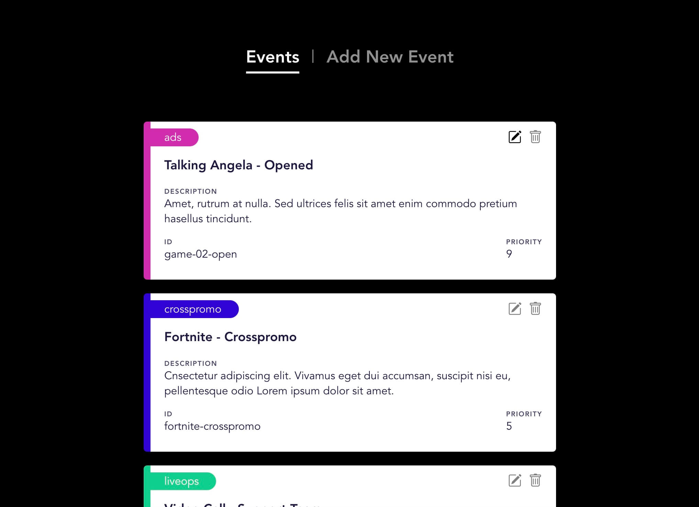

# Events 7 Dashboard

**Event 7 dashboard** is an example of a simple NestJS server application and VueJS front-end interface for adding, editing and deleting events. 

In addition to the basic CRUD functionality, the app also includes:
- a simple error notification system that communicates from the server to a graphical interface,
- a simple system for checking IDs and preventing duplication,
- an example of a more complex verification by external stakeholders (in this case an IP address is used as permission to publish an event with the title 'ads'),
- URL friendly converter.

The app uses:
- **NestJS** for server
- **VueJS** for the front-end interface
- **Does not use a database**, you can add your own DB instance if you wish

## Installation

Install NestJS packages: `npm install`
Install VueJS packages: `cd client` => `npm install`

## Running / developing the application

NestJS, back-end:
`npm run start`  or `npm run start:dev`

VueJS, fron-end:
`npm run serve`  or `npm run build`

That's all!